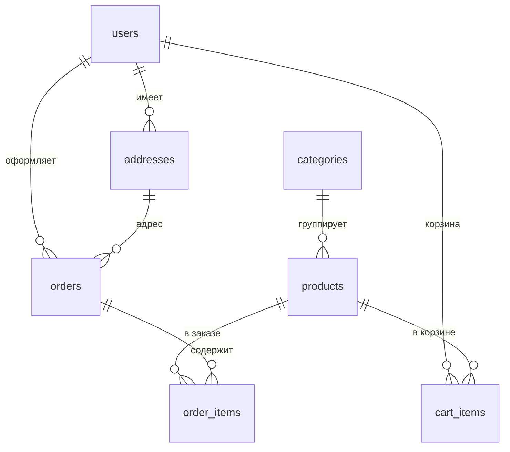

# Магазин чая. Бэкенд.

## Что сделано

Серверная часть реализована и закрывает все функциональные требования MVP: авторизация, каталог товаров, категории, корзина, адреса доставки, оформление заказов и история покупок. Данные пользователей изолированы: каждый запрос к базе ограничен текущим пользователем, обращение к чужому объекту возвращает 404.

API описан в OpenAPI-схеме и доступен в Swagger UI по адресу `/docs`, поэтому фронтенд может работать по живой документации, а не по устным договорённостям. Читаемая версия той же схемы — ReDoc на `/redoc`.

---

## Стек

| Слой | Что используем |
|------|----------------|
| Язык | Python |
| Фреймворк | FastAPI |
| ORM | SQLAlchemy |
| Драйвер БД | asyncpg |
| База | PostgreSQL |
| Валидация | Pydantic  |
| Авторизация | JWT, bcrypt |
| Тесты | pytest, pytest-asyncio, httpx |

---

## Структура

Слоистая архитектура: `api → services → repositories → models`.
```
backend/
├── app/
│   ├── main.py                 # точка входа, подключение роутеров
│   ├── core/
│   │   ├── config.py           # настройки из .env
│   │   └── security.py         # JWT, хеширование паролей
│   ├── db/
│   │   ├── base.py             # Base для моделей
│   │   ├── session.py          # async engine, get_db
│   │   └── deps.py             # get_current_user, get_current_admin
│   ├── models/                 # SQLAlchemy-модели
│   ├── schemas/                # Pydantic-схемы
│   ├── api/                    # роутеры
│   │   └── router.py           # сборка всех роутеров
│   └── data/                   # демо-данные
│       ├── demo_data.json
│       └── demo_data.py
├── tests/                      # pytest
├── alembic/                    # миграции
├── alembic.ini
├── pytest.ini
└── requirements.txt
```

---

## Модель данных

Семь таблиц: `users`, `addresses`, `categories`, `products`, `cart_items`, `orders`, `order_items`.



### users

| Поле | Тип | Описание |
|------|-----|----------|
| id | int PK | |
| email | varchar(255) unique | логин |
| hashed_password | varchar(255) | bcrypt-хеш |
| full_name | varchar(255) | имя |
| role | varchar(20), default `user` | `user`, `seller`, `admin` |
| created_at | timestamptz | |

### addresses

| Поле | Тип | Описание |
|------|-----|----------|
| id | int PK | |
| user_id | FK → users, CASCADE | владелец |
| city | varchar(100) | |
| street | varchar(100) | |
| building | varchar(10) | дом |
| corpus | varchar(10), null | корпус |
| apartment | varchar(10), null | квартира |
| is_default | bool | адрес по умолчанию |
| created_at | timestamptz | |

### categories

| Поле | Тип | Описание |
|------|-----|----------|
| id | int PK | |
| name | varchar(100) unique | «Зелёный чай» |
| slug | varchar(100) unique | для URL |
| description | varchar(500), null | |

### products

| Поле | Тип | Описание |
|------|-----|----------|
| id | int PK | |
| category_id | FK → categories | |
| name | varchar(255) | |
| description | text, null | |
| price | numeric(10,2), check > 0 | |
| stock_quantity | int, check ≥ 0 | остаток |
| weight_grams | int, check > 0 | вес упаковки |
| origin | varchar(100), null | регион |
| image_url | varchar(500), null | |
| created_at | timestamptz | |

### cart_items

Корзина — это набор позиций пользователя. Отдельной таблицы `carts` нет.

| Поле | Тип | Описание |
|------|-----|----------|
| id | int PK | |
| user_id | FK → users, CASCADE | |
| product_id | FK → products, CASCADE | |
| quantity | int, check > 0 | |

### orders

| Поле | Тип | Описание |
|------|-----|----------|
| id | int PK | |
| user_id | FK → users | покупатель |
| address_id | FK → addresses | адрес доставки |
| status | varchar(20), default `created` | `created/paid/shipped/delivered/cancelled` |
| total_price | numeric(10,2), check ≥ 0 | |
| payment_method | varchar(20), default `on_delivery` | |
| created_at | timestamptz | |

### order_items

| Поле | Тип | Описание |
|------|-----|----------|
| id | int PK | |
| order_id | FK → orders, CASCADE | |
| product_id | FK → products | |
| quantity | int, check > 0 | |
| price_at_purchase | numeric(10,2), check > 0 | цена на момент заказа |

---

## Авторизация

- **`POST /api/auth/register`** — регистрация по email и паролю. Дубликат email → 409.
- **`POST /api/auth/login`** — вход, возвращает `access_token` (30 минут) и `refresh_token` (7 дней).
- **`POST /api/auth/refresh`** — новый `access` по `refresh`. Если передан access вместо refresh → 401.
- **`GET /api/auth/me`** — профиль текущего пользователя.

В payload токена лежат `sub` (id пользователя), `exp` (срок) и `type` (`access` или `refresh`). Поле `type` защищает от использования refresh-токена как access и наоборот. Пароль хранится только в виде bcrypt-хеша и в ответах не возвращается.

---

## Каталог и фильтры

### Категории

`GET /api/categories` — публичный список. Создание, изменение и удаление — только для роли `admin`. Дубликат slug → 409.

### Товары

`GET /api/products` — публичный каталог с пагинацией и фильтрами. Формат ответа:

```json
{
  "items": [ ... ],
  "total": 47,
  "page": 1,
  "size": 20
}
```
---

## Корзина

- **`GET /api/cart`** — корзина с `items`, `total_items`, `total_price`.
- **`POST /api/cart/items`** — добавить товар. Если товар уже в корзине — увеличивается `quantity`. Если суммарное количество больше `stock_quantity` → 409.
- **`PATCH /api/cart/items/{id}`** — изменить количество.
- **`DELETE /api/cart/items/{id}`** — удалить позицию.

---

## Адреса

- **`GET /api/addresses`** — список адресов пользователя, отсортированный по `is_default DESC`.
- **`POST /api/addresses`** — добавить адрес. Если `is_default=true`, у остальных адресов флаг снимается.
- **`PATCH /api/addresses/{id}`** — изменить адрес.
- **`DELETE /api/addresses/{id}`** — удалить.

Чужой адрес → 404.

---

## Заказы

- **`POST /api/orders`** — оформление заказа.
- **`GET /api/orders`** — история заказов пользователя.
- **`GET /api/orders/{id}`** — детали заказа. Чужой заказ → 404.
- **`PATCH /api/orders/{id}/status`** — смена статуса, только для админа. Недопустимый статус → 400.

---

## API

| Метод | Адрес | Действие |
|-------|-------|----------|
| POST | `/auth/register` | регистрация |
| POST | `/auth/login` | вход |
| POST | `/auth/refresh` | новый access по refresh |
| GET | `/auth/me` | профиль |
| GET | `/categories` | список категорий |
| GET | `/categories/{id}` | одна категория |
| POST/PATCH/DELETE | `/categories/{id}` | управление (админ) |
| GET | `/products` | каталог с фильтрами |
| GET | `/products/{id}` | карточка товара |
| POST/PATCH/DELETE | `/products/{id}` | управление (админ) |
| GET | `/cart` | корзина |
| POST | `/cart/items` | добавить товар |
| PATCH/DELETE | `/cart/items/{id}` | изменить/удалить позицию |
| GET/POST | `/addresses` | адреса |
| PATCH/DELETE | `/addresses/{id}` | изменить/удалить адрес |
| POST | `/orders` | оформить заказ |
| GET | `/orders` | история |
| GET | `/orders/{id}` | детали заказа |
| PATCH | `/orders/{id}/status` | смена статуса (админ) |
| GET | `/docs` | Swagger UI |
| GET | `/redoc` | ReDoc |

---

## Демо-данные

Скрипт `app/data/demo_data.py` наполняет базу тестовыми категориями и товарами из `demo_data.json`.

Запуск:

```
python -m app.data.demo_data
```

---

## Тесты

Тесты идут против отдельной БД, каждый тест обёрнут в транзакцию и откатывается в конце — данные между тестами не накапливаются.

| Файл | Что проверяет |
|------|---------------|
| `test_auth.py` | регистрация, дубликат email, валидация, вход, refresh, /me |
| `test_categories.py` | CRUD, права админа, дубликат slug, 404 |
| `test_products.py` | CRUD, права, фильтры, поиск, сортировка, пагинация |
| `test_cart.py` | добавление, изменение, удаление, ограничения по остаткам |
| `test_orders.py` | оформление, списание остатков, очистка корзины, статусы |
| `test_isolation.py` | чужой заказ, чужая позиция корзины, чужой адрес |

Запуск:

```
pytest -v
```

---

## Требования

| ID | Требование | Как реализовано |
|----|-----------|-----------------|
| FR-01 | Регистрация, вход, выход | JWT, bcrypt, access + refresh, `/auth/me` |
| FR-02 | Каталог товаров | `GET /products` с пагинацией и фильтрами |
| FR-03 | Категоризация | `categories` + FK у товара |
| FR-04 | Корзина | `cart_items`, сохранение между сессиями |
| FR-05 | Оформление заказа | транзакция, списание остатков, фиксация цены |
| FR-06 | История заказов | `GET /orders`, `GET /orders/{id}` |
| FR-07 | Админский CRUD | `get_current_admin` на товарах и категориях |
| FR-08 | Поиск и фильтры | поиск по названию и описанию, фильтр по категории, цене, наличию |
| NFR-01 | Хеширование паролей | bcrypt, в БД только хеш |
| NFR-02 | Изоляция данных | фильтр по `user_id` в каждом запросе, чужое → 404 |
| NFR-03 | Остатки не в минусе | `SELECT ... FOR UPDATE` + проверка в транзакции |
| NFR-04 | JWT с ограниченным сроком | access 30 минут, refresh 7 дней |

---

## Как запустить

```
cd backend
python -m venv .venv
.venv\Scripts\activate
pip install -r requirements.txt

# создать БД и применить миграции
psql -U postgres
CREATE DATABASE tea_shop_db;
\q
alembic upgrade head

# демо-данные
python -m app.data.demo_data

# запустить
uvicorn app.main:app --reload
```
API: http://localhost:8000/api/
Swagger: http://localhost:8000/docs