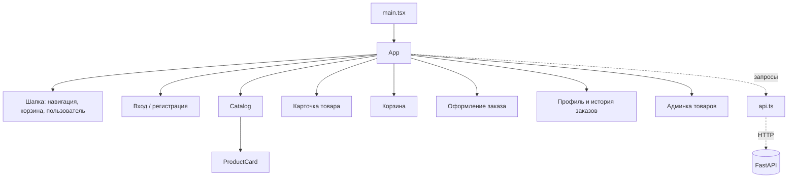

# Магазин чая. Фронтенд.

## Что сделано

Клиентская часть реализована и закрывает все функциональные требования MVP со стороны интерфейса: вход и регистрация, каталог с поиском и фильтрами, карточка товара, корзина, оформление заказа с выбором адреса доставки, профиль с историей покупок и раздел администратора для управления товарами. В интерфейсе нет ни одного захардкоженного товара, заказа или пользователя: все данные приходят от бэкенда из базы `tea_shop_db`.

Фронтенд работает по OpenAPI-схеме бэкенда (`/docs`), а не по устным договорённостям. Права разграничены по полю `role` из `/api/auth/me`: раздел `/admin` доступен только администратору, остальные маршруты, зависящие от пользователя (корзина, заказ, профиль), требуют входа. Серверные ошибки (409 по остаткам, 404, 422) показываются пользователю текстом из поля `detail`.

---

## Стек

| Слой | Что используем |
|------|----------------|
| Язык | TypeScript |
| UI | React 19 |
| Маршрутизация | React Router 7 |
| Сборка и dev-сервер | Vite 8 |
| Иконки | lucide-react |
| Стили | CSS (`styles.css`, переменные в `:root`) |
| Обмен с бэкендом | `fetch`, JWT в заголовке `Authorization` |
| Проверка | `tsc -b` (строгая типизация) |

---

## Структура

Состояние приложения хранится в корневом компоненте `App`, обращения к бэкенду собраны в одном модуле `api.ts`.
```
frontend/
├── src/
│   ├── main.tsx          # точка входа, BrowserRouter
│   ├── App.tsx           # состояние, маршруты, страницы
│   ├── Admin.tsx         # раздел администратора (CRUD товаров)
│   ├── api.ts            # типы ответов и все запросы к API
│   ├── styles.css        # стили
│   └── vite-env.d.ts
├── index.html
├── vite.config.ts        # dev-сервер, proxy /api → localhost:8000
├── tsconfig.json
├── package.json
├── .env.example          # VITE_API_URL
└── README.md
```

### Компоненты



---

## Модель данных

Фронтенд не хранит данные сам, а описывает в `api.ts` типы, которые совпадают со схемами бэкенда.

| Тип | Поля |
|-----|------|
| `ApiUser` | id, email, full_name, role, created_at |
| `ApiCategory` | id, name, slug, description |
| `ApiProduct` | id, name, description, price, stock_quantity, weight_grams, origin, image_url, category_id, created_at |
| `ApiCart` | items, total_items, total_price |
| `ApiCartItem` | id, product_id, quantity |
| `ApiAddress` | id, city, street, building, corpus, apartment, is_default |
| `ApiOrder` | id, status, total_price, payment_method, created_at, items |
| `ApiOrderItem` | product_id, quantity, price_at_purchase |
| `Tokens` | access_token, refresh_token, token_type |

Состояние в `App`:

| Состояние | Источник |
|-----------|----------|
| `products`, `categories` | `GET /products`, `GET /categories` при старте |
| `user` | `GET /auth/me`, если в localStorage есть токен |
| `cart` | `GET /cart`, после каждого изменения загружается заново |
| `orders` | `GET /orders`, пока пользователь вошёл |

В localStorage хранятся только JWT-токены.

---

## Авторизация

- **Вход** — окно «Войти / Зарегистрироваться» в шапке, `POST /api/auth/login`. Токены сохраняются в localStorage, затем запрашивается `GET /api/auth/me`.
- **Регистрация** — `POST /api/auth/register`, после успеха выполняется автоматический вход. Дубликат email → сообщение об ошибке 409.
- **Восстановление сессии** — при открытии страницы, если есть токен, профиль запрашивается автоматически. Недействительный токен удаляется.
- **Выход** — кнопка в профиле, токены и корзина в состоянии очищаются.
- **Роли** — после входа администратор перенаправляется в `/admin`, покупатель в `/profile`. Ссылка «Админка» в шапке видна только при `role = admin`, при прямом переходе по `/admin` остальных возвращает на главную.

Токен добавляется ко всем запросам заголовком `Authorization: Bearer ...`.

---

## Каталог и фильтры

`/` — главная страница каталога. Товары загружаются с бэкенда (`GET /api/products`), карточка показывает название, категорию, происхождение, вес упаковки и цену.

- **Поиск** — по названию, происхождению и описанию.
- **Фильтр по категории** — выпадающий список из `GET /api/categories`.
- **Сортировка** — по умолчанию, по возрастанию и убыванию цены, по названию.
- **Наличие** — товары с нулевым остатком помечены «Нет в наличии», кнопка покупки отключена.
- **Состояния** — индикатор загрузки, сообщение при недоступном бэкенде, пустая выдача со сбросом фильтров.

`/product/:id` — карточка товара: категория, описание, происхождение, вес, остаток, цена и кнопка «Купить».

Изображения пока не подключены: если `image_url` пуст, вместо фото выводится нейтральная заглушка.

---

## Корзина

Корзина серверная (`cart_items`), поэтому сохраняется между сессиями и устройствами. Для неавторизованного пользователя нажатие «Купить» открывает окно входа.

- **`GET /api/cart`** — загрузка при входе и после каждого изменения.
- **`POST /api/cart/items`** — добавление товара.
- **`PATCH /api/cart/items/{id}`** — изменение количества кнопками «+» и «−».
- **`DELETE /api/cart/items/{id}`** — удаление позиции, когда количество доходит до нуля.

Ограничение по остаткам проверяет бэкенд (ошибка 409 выводится сообщением над страницей), на фронте кнопка «+» дополнительно отключается при достижении `stock_quantity`. Сумма считается как цена за упаковку, умноженная на количество.

---

## Адреса

Отдельной страницы адресов нет, адреса выбираются и создаются на шаге оформления заказа.

- **`GET /api/addresses`** — сохранённые адреса пользователя показываются списком, адрес по умолчанию отмечен.
- **`POST /api/addresses`** — если выбран пункт «Новый адрес», перед заказом создаётся адрес из формы (город, улица, дом, корпус, квартира). Первый адрес пользователя становится адресом по умолчанию.

---

## Заказы

- **Оформление** (`/checkout`) — выбор или ввод адреса, затем `POST /api/orders` с `address_id` и `payment_method = on_delivery`. Состав заказа бэкенд берёт из серверной корзины. После успеха корзина, история заказов и остатки товаров перезагружаются.
- **История** — в профиле выводятся номер, дата, статус (создан, оплачен, отправлен, доставлен, отменён), состав и сумма `total_price`. Названия товаров подставляются по `product_id`.
- **Доступ** — без входа оформление недоступно, вместо формы предлагается войти.

---

## Админка

Раздел `/admin` доступен только роли `admin`, данные идут напрямую в БД через API.

- **Список товаров** — название, категория, вес, остаток, цена.
- **Создание** — форма: название, описание, цена, вес упаковки, остаток, происхождение, категория (`POST /api/products`).
- **Изменение** — кнопка «Изменить» подставляет товар в форму (`PATCH /api/products/{id}`).
- **Удаление** — с подтверждением (`DELETE /api/products/{id}`).

Ошибки валидации бэкенда (например, цена не больше нуля) показываются под формой.

---

## API

Эндпоинты, которые использует фронтенд:

| Метод | Адрес | Где используется |
|-------|-------|------------------|
| POST | `/auth/register` | регистрация |
| POST | `/auth/login` | вход |
| GET | `/auth/me` | профиль, роль, восстановление сессии |
| GET | `/categories` | фильтр каталога, форма админки |
| GET | `/products` | каталог, корзина, карточка, профиль |
| POST/PATCH/DELETE | `/products/{id}` | админка |
| GET | `/cart` | корзина |
| POST | `/cart/items` | добавить товар |
| PATCH/DELETE | `/cart/items/{id}` | изменить/удалить позицию |
| GET/POST | `/addresses` | выбор и создание адреса при оформлении |
| POST | `/orders` | оформить заказ |
| GET | `/orders` | история заказов |

В режиме разработки запросы `/api/*` проксируются Vite на `http://localhost:8000`, поэтому CORS на бэкенде менять не нужно.

---

## Демо-данные

Каталог и категории берутся из базы, которую наполняет `python -m app.data.demo_data`. Для проверки интерфейса в скрипт добавлены два тестовых аккаунта:

| Роль | Email | Пароль |
|------|-------|--------|
| admin | admin@teashop.local | Admin12345 |
| user | user@teashop.local | User12345 |

---

## Тесты

Автотестов на фронтенде пока нет. Проверка:

| Что | Как |
|-----|-----|
| Типизация | `npm run build` (`tsc -b` + сборка Vite) |
| Работа с API | вручную по сценариям ниже, ответы сверяются со Swagger |

Сценарии ручной проверки: вход под admin и user, регистрация нового пользователя, поиск и фильтр, добавление в корзину сверх остатка (ошибка 409), оформление заказа с новым и с сохранённым адресом, появление заказа в истории и списание остатка, создание, изменение и удаление товара в админке, недоступность `/admin` для обычного пользователя.

---

## Требования

| ID | Требование | Как реализовано |
|----|-----------|-----------------|
| FR-01 | Регистрация, вход, выход | окно входа, JWT в localStorage, `/auth/me`, кнопка «Выйти» |
| FR-02 | Каталог товаров | страница `/`, данные из `GET /products` |
| FR-03 | Категоризация | фильтр по категории, название категории в карточке |
| FR-04 | Корзина | серверная корзина, сохраняется между сессиями |
| FR-05 | Оформление заказа | выбор или создание адреса, `POST /orders`, обновление остатков |
| FR-06 | История заказов | профиль, `GET /orders` |
| FR-07 | Админский CRUD | раздел `/admin`, доступ по `role` |
| FR-08 | Поиск и фильтры | поиск по названию, происхождению, описанию; категория; сортировка по цене и названию |
| NFR-01 | Пароли не хранятся на клиенте | в localStorage только токены |
| NFR-02 | Изоляция данных | запросы идут с токеном, чужие данные бэкенд не отдаёт |
| NFR-03 | Остатки не в минусе | ограничение «+» на фронте, окончательная проверка в бэкенде |
| NFR-04 | Адаптивный интерфейс | относительные размеры, мобильное меню в шапке |

---

## Как запустить

Предварительно должен быть запущен бэкенд (`uvicorn app.main:app --reload`, порт 8000) и выполнен `python -m app.data.demo_data`.

```
cd frontend
npm install
copy .env.example .env.local
npm run dev
```
Приложение: http://localhost:5173

Если API работает на другом адресе, поменяйте `target` в `vite.config.ts` или задайте `VITE_API_URL` в `.env.local`.
